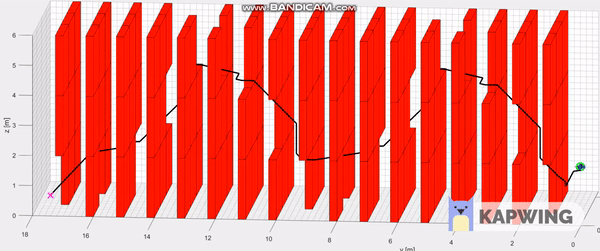
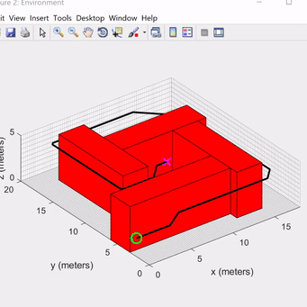

# Quadrotors-Control-Trajectory-Planning
Implementation of a flight controller, A* planner, and trajectory generator for quadrotor

1. Casecade Control Structure: Outer-loop Position Control and Inner loop attitude control.
2. Efficient A* planner using a self coded Priority Queue API
3. Minimum Snap trajectory generator to generate smooth optimal trajectory for the quadrotors to track

Trajectory generation with waypoints pruning.

Tested on the Crazyflie micro-drone platform

